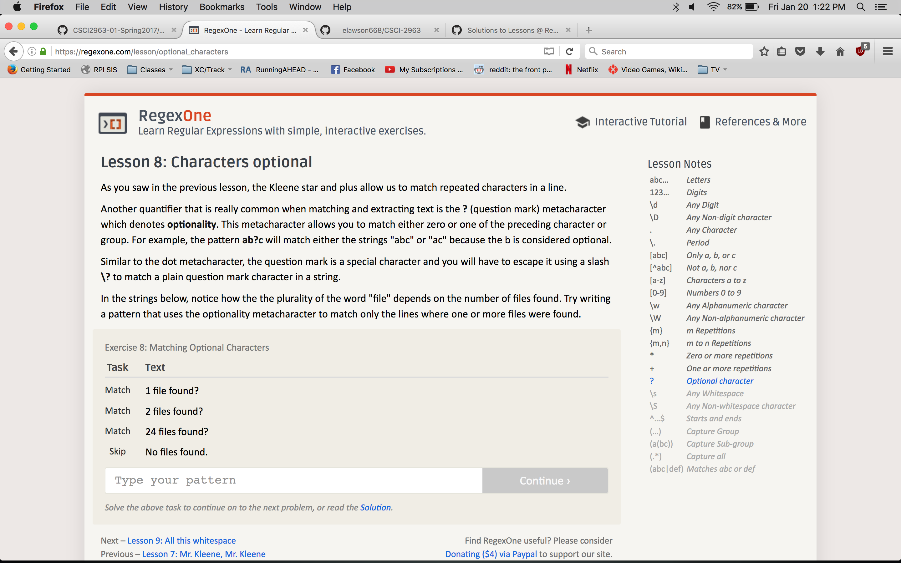
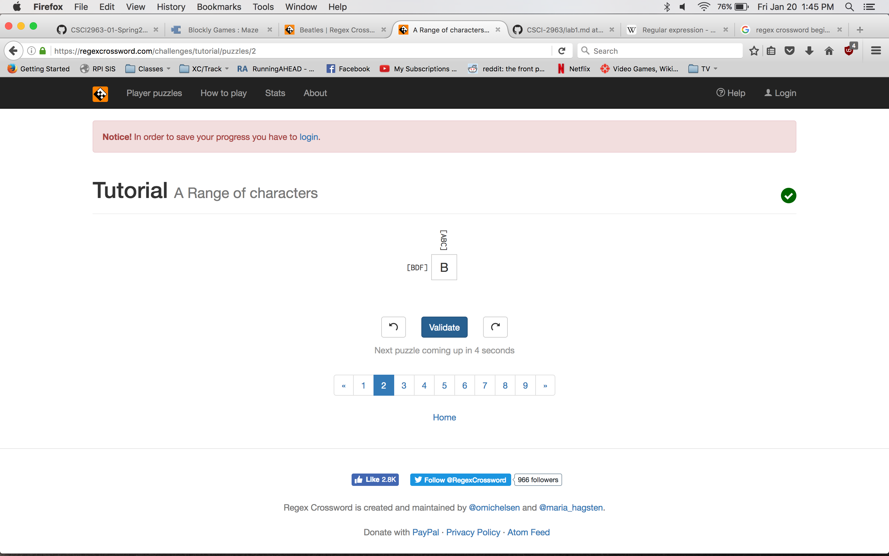
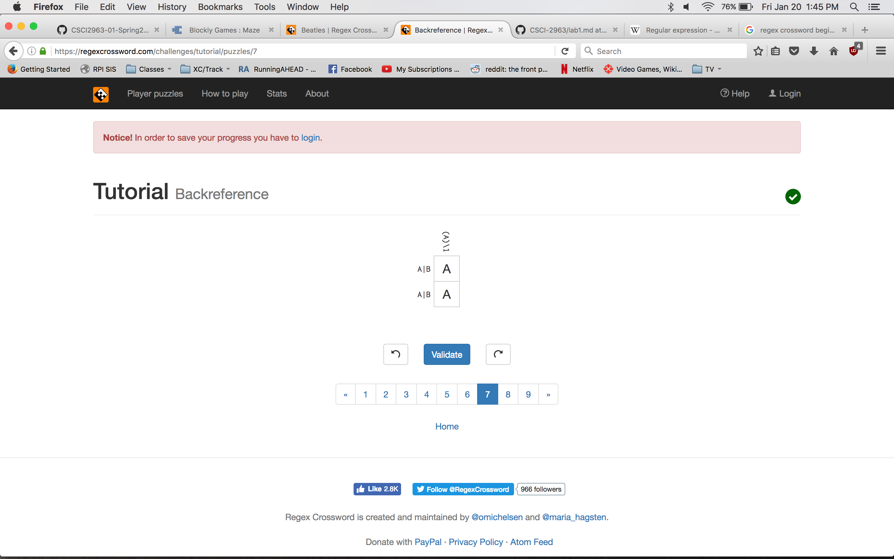
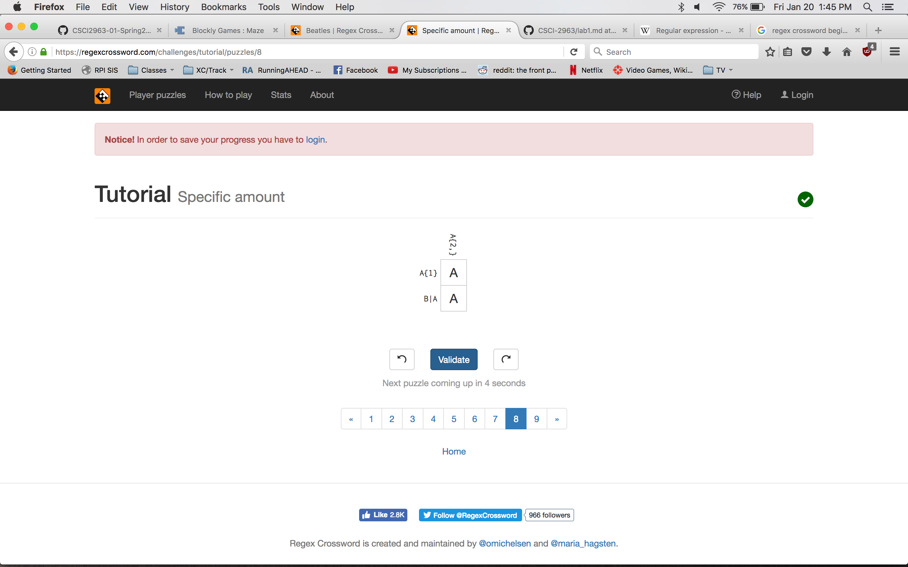
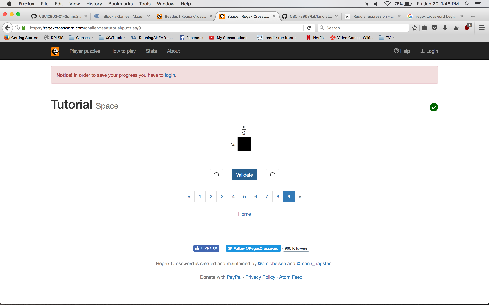
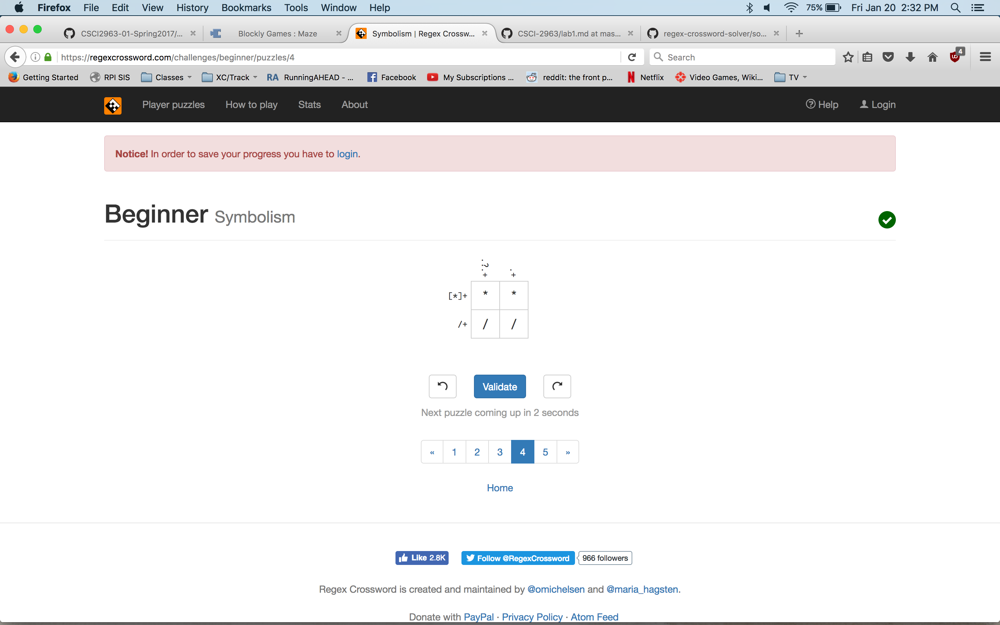
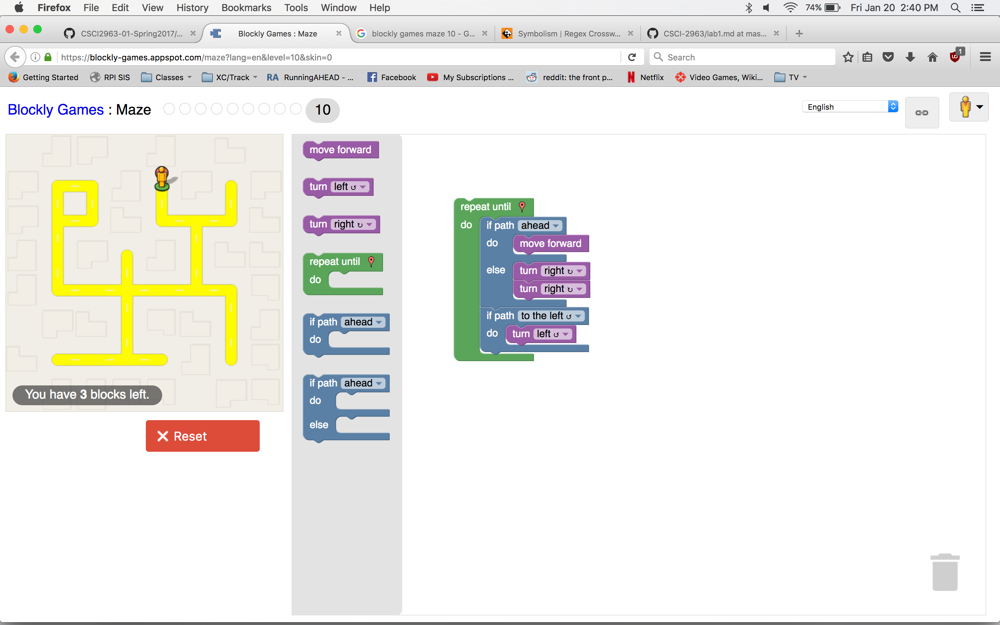

2 more ways to answer questions in a helpful way:

1) Help the person answer their own question. Give them suggestions towards the right direction, but don't just give out the answer. 

2) Be willing to learn from the person asking you a question. 

Thoughts on Free Culture Chapter 3:

I think that this whole situation is absurd. However, it doesn't suprise me in the least. With the way that copyright laws in this country
are written, organizations like the RIAA and the MPAA have the power to relentlessly pursue lawsuits against people who most of the time
have done next to nothing wrong. This comes down to the debate of whether or not the manufacturer of a product is liable for anything bad
done with that product. You see it with people filing lawsuits against gun manufacturers because of the crimes committed with their product.
I don't see this situation as any different. Jesse Jordan only created the search engine, he had no role in the distribution of copyrighted
material. I don't think he should be liable for this, any more than Ford is liable for a car accident. I think copyright laws need to be 
severely rewritten in this country, or else the RIAA, MPAA, and other organizations will continue to steal people's money when they have no
other choice. 

Tree installed:

Regex, 7 lessons completed:

Regex problems:

Solved Blockly maze puzzle:

Project ideas:

Ideally for my project I would like to contribute something meaningful. My father is a graphic designer, and has often told me that the software he uses is not intuitively 
designed. It is designed only for functionality, and not usability. I think I am in a unique position to help to solve this issue. Hopefully I can find a project that interests
me, as I would love to make an important contribution to a piece of software. I think doing so would give me a lot of experience, and it would definitely help to bolster my 
resume. 

