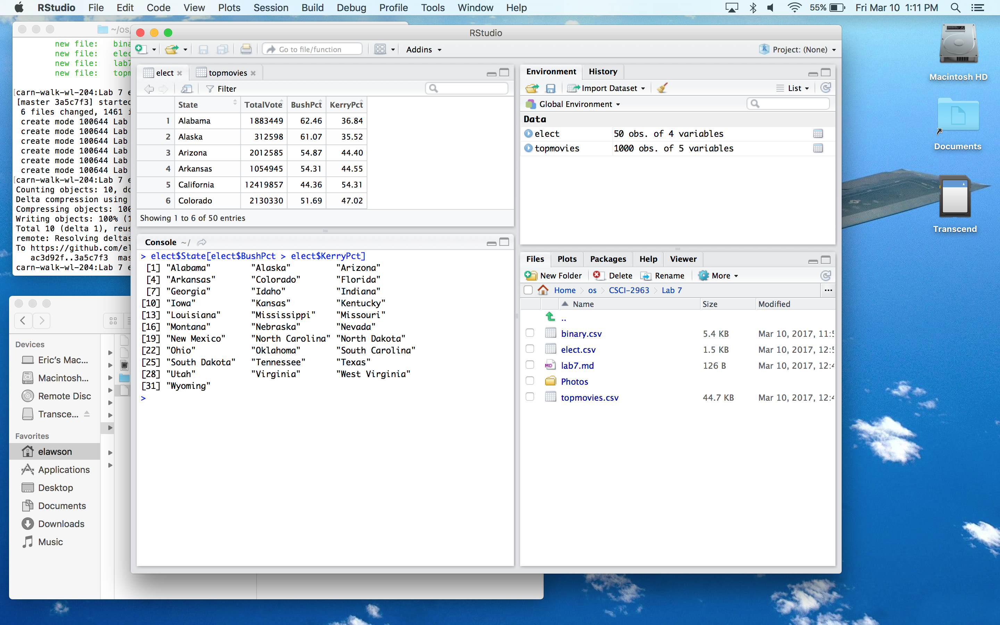

New rules found from binary.csv - 

Plot of new rules - 

All states where Bush won - 

Plot of most successful movies by year - 

Movies with "Man" in the title - 

Link to project repository - 

https://github.com/shanalily/DeepReader

So far we have not done much work on the project but we plan on dividing up the work and getting started on
the bulk of the work next week over break. At first we will mostly be doing research on how to use Qt, as well as 
the basics of the implementing a text editor and pdf viewer. Hopefully in 2-3 weeks we will have the basic functionality
completed, and can start working on implementing more advanced features.